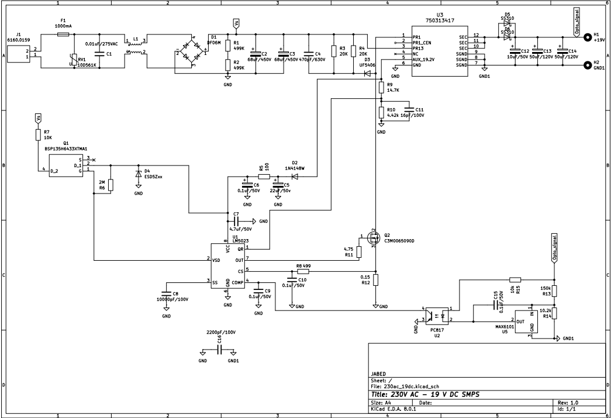
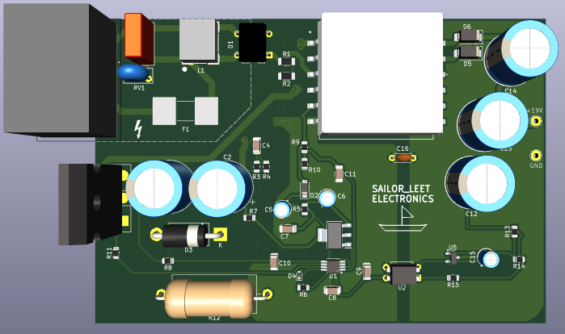

# SMPS SPECIFICATIONS
- Input Voltage: 230V AC (rectified to ~325V DC)
- Output Voltage: 19V DC
- Output Current: 3A
- Output Power: Up to 60W (maximum)

# SCHEMATIC DIAGRAM

# PCB 3D VIEW

# CALCULATION

### Transformer Turns Ratio Calculation

To determine the turns ratio of a transformer, use the following formula:

Np / Ns = Vin / (Vout + Vd)

Where:  
- **\(N_p\)**: Number of primary winding turns  
- **\(N_s\)**: Number of secondary winding turns  
- **\(V_in\)**: Input voltage to the transformer (325V DC in this example)  
- **\(V_out\)**: Desired output voltage (19V DC in this case)  
- **\(V_d\)**: Voltage drop across the secondary diode (approximately 0.5V for a Schottky diode)  

#### Example Calculation:

For an output voltage of 19V:

Np / Ns = 325V / (19V + 0.5V)

Np / Ns = 325 / 19.5 ≈ 16.66

Thus, the primary-to-secondary turns ratio is approximately **17:1**.

### Turns Ratio Calculation

The number of primary turns (**Np**) can be calculated using the volt-second balance equation:

Np = (Vin × ton) / (Bmax × Ae)

Where:  
- **Vin**: Input voltage (325V)  
- **ton**: On-time of the switch (calculated based on the duty cycle, typically 50% at maximum load)  
- **Bmax**: Maximum magnetic flux density (e.g., 2000 Gauss or 0.2T for ferrite cores)  
- **Ae**: Effective cross-sectional area of the core  

#### Example Calculation:

For a switching frequency of **130 kHz** (period = 7.7µs) and a 50% duty cycle, the on-time (\(ton\)) is:

ton = 50% of 7.7µs = 3.35µs

Assume the following parameters for an ETD39 core:  
- **Bmax = 0.2T**  
- **Ae = 125mm² (125 × 10⁻⁶ m²)**  

Substitute the values into the formula:

Np = (325V × 3.35µs) / (0.2T × 125 × 10⁻⁶ m²) Np ≈ 43.5 turns

Thus, the primary winding requires approximately **44 turns**.

### Number of Secondary Turns Calculation

Using the turns ratio and the calculated number of primary turns, the number of secondary turns (**Ns**) can be calculated as follows:

Ns = Np / Turns Ratio

Where:  
- **Np**: Number of primary turns (calculated previously as 85 turns)  
- **Turns Ratio**: Primary-to-secondary turns ratio (17:1 in this example)  

#### Example Calculation:

Substitute the values into the formula:

Ns = 44 / 17 Ns ≈ 2.5 turns

So the turns number is **3**.
### Reference Voltage

Using a voltage divider with resistors of **150 kΩ** and **10.2 kΩ** creates the following ratio:

Vout = Vin * (R_lower / (R_upper + R_lower))

Where:  
- **Vin**: Input voltage  
- **R_lower**: Resistor connected to the ground (10.2 kΩ)  
- **R_upper**: Resistor connected to the input voltage (150 kΩ)  

#### Example Calculation:

For an input voltage of **19V**:

Vout = 19V * (10.2 kΩ / (150 kΩ + 10.2 kΩ))

Vout = 19V * (10.2 / 160.2) ≈ 1.21V

This is very close to the reference voltage of the **MAX6101**, which is **1.25V**.

# COMPONENTS
| Component        | Value          | Package                                    | Quantity |
|------------------|----------------|--------------------------------------------|----------|
| C1               | 0.01uF/275VAC  | Capacitor_THT:C_Rect_L10.0mm_W4.0mm_P7.50mm_MKS4 | 1        |
| C2, C3           | 68uF/450V      | Capacitor_THT:CP_Radial_D12.5mm_P7.50mm    | 2        |
| C4               | 470pF/630V     | Capacitor_SMD:C_1206_3216Metric            | 1        |
| C5               | 22uF/50V       | Capacitor_THT:CP_Radial_D4.0mm_P2.00mm     | 1        |
| C6, C9, C10, C15 | 0.1uF/50V      | -- mixed values --                         | 4        |
| C7               | 4.7uF/50V      | Capacitor_SMD:C_1206_3216Metric            | 1        |
| C8               | 10000pF/100V   | Capacitor_SMD:C_1206_3216Metric            | 1        |
| C11              | 16pF/100V      | Capacitor_SMD:C_1206_3216Metric            | 1        |
| C12              | 10uF/50V       | Capacitor_THT:CP_Radial_D12.5mm_P7.50mm    | 1        |
| C13, C14         | 50uF/120V      | Capacitor_THT:CP_Radial_D12.5mm_P7.50mm    | 2        |
| C16              | 2200pF/100V    | Capacitor_THT:C_Disc_D4.3mm_W1.9mm_P5.00mm | 1        |
| D1               | DF06M          | Diode_THT:Diode_Bridge_DIP-4_W7.62mm_P5.08mm | 1        |
| D2               | 1N4148W        | Diode_SMD:D_SOD-123                        | 1        |
| D3               | UF5406         | Diode_THT:D_DO-201AD_P15.24mm_Horizontal   | 1        |
| D4               | ESD5Zxx        | Diode_SMD:D_SOD-523                        | 1        |
| D5, D6           | SS310          | Diode_SMD:D_SMA                            | 2        |
| F1               | 1000mA         | Fuse:Fuse_Littelfuse-NANO2-462             | 1        |
| J1               | 6160.0159      | private:61600159                           | 1        |
| L1               | L_Coupled_1342 | private:WE-SL5_HC                          | 1        |
| Q1               | BSP135H6433XTMA1| private:SOT230P700X180-4N                  | 1        |
| Q2               | C3M0065090D    | Package_TO_SOT_THT:TO-247-3_Vertical       | 1        |
| R1, R2           | 499K           | Resistor_SMD:R_1206_3216Metric             | 2        |
| R3, R4           | 20K            | Resistor_SMD:R_0805_2012Metric             | 2        |
| R5               | 100            | Resistor_SMD:R_0805_2012Metric             | 1        |
| R6               | 2M             | Resistor_SMD:R_0805_2012Metric             | 1        |
| R7               | 10K            | Resistor_SMD:R_0805_2012Metric             | 1        |
| R8               | 499            | Resistor_SMD:R_0805_2012Metric             | 1        |
| R9               | 14.7K          | Resistor_SMD:R_0805_2012Metric             | 1        |
| R10              | 4.42k          | Resistor_SMD:R_0805_2012Metric             | 1        |
| R11              | 4.75           | Resistor_SMD:R_0805_2012Metric             | 1        |
| R12              | 0.15           | Resistor_THT:R_Axial_DIN0922_L20.0mm_D9.0mm_P25.40mm_Horizontal | 1 |
| R13              | 150k           | Resistor_SMD:R_0805_2012Metric             | 1        |
| R14              | 10.2k          | Resistor_SMD:R_0805_2012Metric             | 1        |
| R15              | 10k            | Resistor_SMD:R_0805_2012Metric             | 1        |
| RV1              | 10D561K        | Varistor:RV_Disc_D7mm_W3.6mm_P5mm          | 1        |
| U1               | LM5023         | Package_SO:VSSOP-8_3.0x3.0mm_P0.65mm       | 1        |
| U2               | PC817          | Package_DIP:DIP-4_W7.62mm                  | 1        |
| U3               | 750313417      | private:SMD_13417_WRE                      | 1        |
| U5               | MAX6101        | Package_TO_SOT_SMD:SOT-23                  | 1        |
